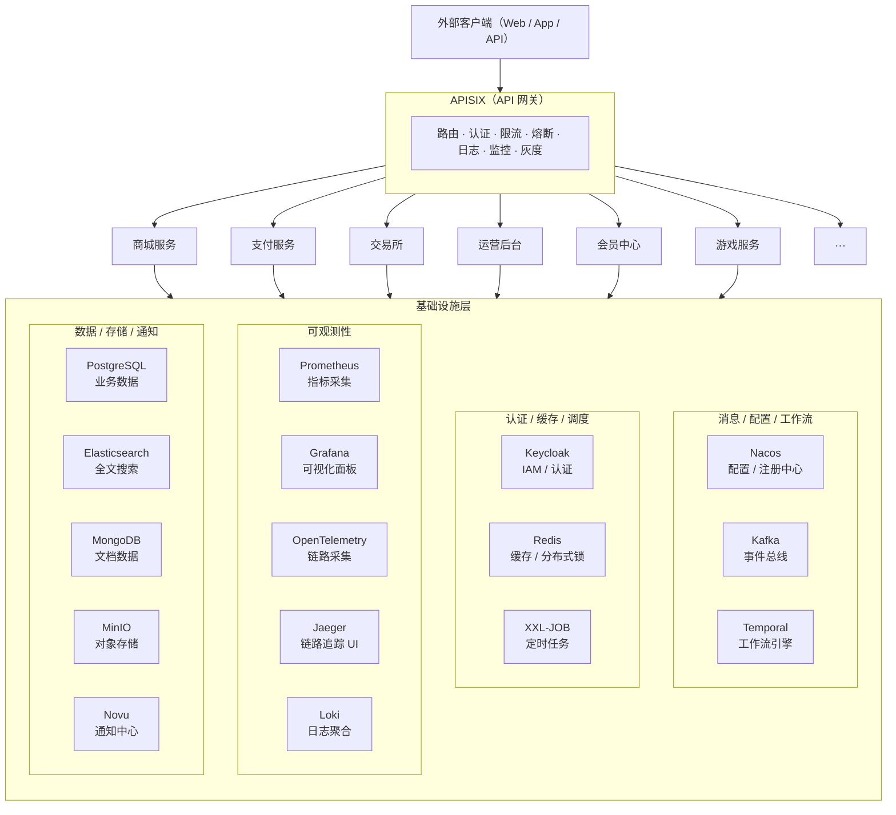

# 微服务基座 microservice-infra

Docker Compose 一键部署的微服务基础设施底座，覆盖数据、消息、网关、监控、链路、日志、认证、调度、通知、存储等全链路。

## 快速启动

```bash
# 1. 复制环境变量并修改
cp .env.example .env

# 2. 启动全部服务
docker compose up -d

# 3. 查看状态
docker compose ps
```

## 服务一览

### 数据层
| 服务 | 镜像 | 端口 | 说明 |
|------|------|------|------|
| PostgreSQL 17 | `postgres:17-alpine` | 5432 | 关系数据库（多库初始化） |
| Redis 7 | `redis:7-alpine` | 6379 | 缓存 / 分布式锁 |
| MongoDB 8 | `mongo:8.0` | 27017 | 文档数据库 |
| MySQL 8 | `mysql:8.0` | 3306 | XXL-JOB 调度库 |
| ClickHouse 24 | `clickhouse/clickhouse-server:24.3-alpine` | 8123 | 列式分析引擎 |
| Elasticsearch 8 | `elasticsearch:8.16` | 9200 | 全文搜索（单节点，512m） |

### 消息 & 配置 & 工作流
| 服务 | 镜像 | 端口 | 说明 |
|------|------|------|------|
| Kafka 4.3 | `apache/kafka:4.3` | 9092 | 事件总线 |
| ZooKeeper 3.8 | `zookeeper:3.8` | 2181 | Kafka 协调 |
| Nacos 2.2 | `nacos/nacos-server:v2.2.3` | 8848 | 配置 / 注册中心 |
| Temporal 1.23 | `temporalio/auto-setup:1.23.1` | 7233 | 工作流引擎 |

### 网关 & 代理
| 服务 | 镜像 | 端口 | 说明 |
|------|------|------|------|
| APISIX 3.7 | `apache/apisix:3.7.0-debian` | 9080/9180/9443 | API 网关 |
| etcd 3.5 | `quay.io/coreos/etcd:v3.5.15` | 2379 | APISIX 配置存储 |
| Nginx | `nginx:alpine` | 8082 | 静态代理 / 反向代理 |

### 认证 & 通知
| 服务 | 镜像 | 端口 | 说明 |
|------|------|------|------|
| Keycloak 24 | `quay.io/keycloak/keycloak:24.0.4` | 8080 | IAM / 认证授权 |
| Novu 3.17 | `ghcr.io/novuhq/novu` | 3000/4000/3002 | 多渠道通知中心（API / Dashboard / WS） |

### 可观测性
| 服务 | 镜像 | 端口 | 说明 |
|------|------|------|------|
| Prometheus | `prom/prometheus:latest` | 9090 | 指标采集 |
| Grafana 10.4 | `grafana/grafana:10.4.5` | 3001 | 可视化面板（含 Prometheus & Loki 数据源） |
| OTel Collector | `otel/opentelemetry-collector:0.153` | 4317/4318 | 链路数据采集（导出到 Jaeger） |
| Jaeger 1.60 | `jaegertracing/all-in-one:1.60` | 16686 | 链路追踪 UI |
| Loki 3.0 | `grafana/loki:3.0.0` | 3100 | 日志聚合 |

### 存储 & 仓库
| 服务 | 镜像 | 端口 | 说明 |
|------|------|------|------|
| MinIO | `minio/minio:latest` | 9005(S3) / 9006(Console) | S3 兼容对象存储 |
| Registry 2 | `registry:2` | 5000 | Docker 私有镜像仓库 |
| LocalStack 0.14 | `localstack/localstack:0.14.5` | 4566 | AWS 本地云模拟 |

### 调度 & 工具
| 服务 | 镜像 | 端口 | 说明 |
|------|------|------|------|
| XXL-JOB 2.4 | `xuxueli/xxl-job-admin:2.4.1` | 8081 | 分布式定时调度 |

## 架构图



## 端口占用总表

| 端口 | 服务 | 说明 |
|------|------|------|
| 5432 | PostgreSQL | 关系数据库 |
| 6379 | Redis | 缓存 |
| 27017 | MongoDB | 文档库 |
| 3306 | MySQL | XXL-JOB 库 |
| 8123 / 9000 | ClickHouse | 分析引擎 |
| 9200 | Elasticsearch | 搜索索引 |
| 9090 | Prometheus | 指标采集 |
| 3001 | Grafana | 可视化面板 |
| 3100 | Loki | 日志聚合 |
| 16686 | Jaeger | 链路追踪 UI |
| 4317 / 4318 | OTel Collector | OTLP 数据接入 |
| 9080 / 9180 / 9443 | APISIX | API 网关 |
| 2379 | etcd | 网关配置存储 |
| 2181 | ZooKeeper | Kafka 协调 |
| 9092 | Kafka | 事件总线 |
| 8848 | Nacos | 配置 / 注册中心 |
| 7233 | Temporal | 工作流引擎 |
| 8080 | Keycloak | 认证授权 |
| 3000 / 4000 / 3002 | Novu | 通知中心 |
| 8081 | XXL-JOB | 定时调度 |
| 4566 | LocalStack | AWS 模拟 |
| 8082 | Nginx | 反向代理 |
| 5000 | Registry | 私有镜像仓库 |
| 9005 / 9006 | MinIO | 对象存储 |

## 设计原则

1. **去 Bitnami 化** —— 所有镜像来自项目官方或官方 registry（Docker Hub / quay.io / ghcr.io / docker.elastic.co），不依赖第三方打包版
2. **可复现** —— 所有镜像固定版本号，避免 latest 漂移导致不兼容
3. **配置分离** —— 敏感配置通过 `.env` 管理，不提交 Git
4. **即插即用** —— 新增服务只需创建子目录 + 在 `compose.yaml` 里加一行 include
