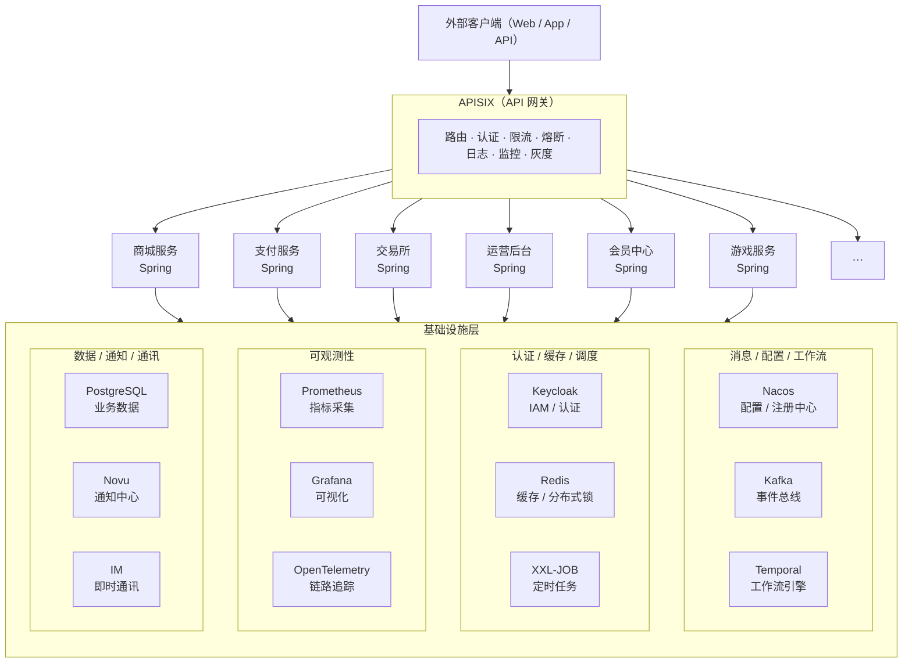

# 微服务基座搭建

## 基础设施（外部开源库）

### **为什么选择开源项目**

  1. 为了统一，不可能每套后端都写一遍基础设施！
  2. 快速上线；
  3. 减少后端基础设施维护成本（只需要同步上游）。

- APISIX          API网关
- Keycloak        身份认证
- Kafka           事件总线
- Novu            通知中心
- IM              即时通讯（open-im）
- Nacos           配置中心
- Prometheus      指标监控
- Grafana         可视化监控
- OpenTelemetry   链路追踪
- Temporal        工作流
- XXL-JOB         定时任务

## 业务系统层（spring boot）

- 商城
- 支付
- 交易所
- 博彩
- CRM
- ERP
- 小程序
- 运营后台
- 会员中心
- 代理系统
- More...

---

## 架构图

