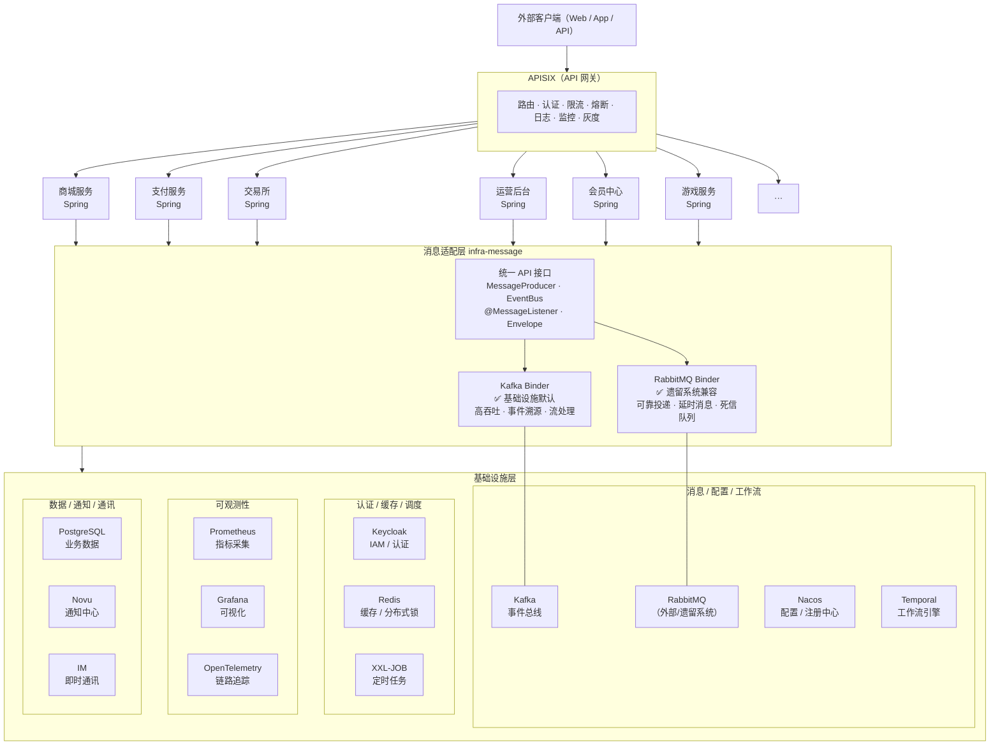
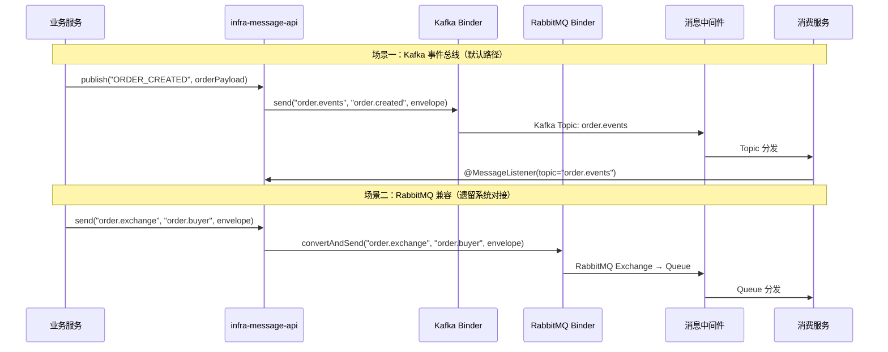

# 架构图

## 整体架构



## 消息流（时序）



## 目录结构

```
microservices/
├── compose.yaml                 ← 基础设施 Docker Compose
├── infra-adapter/               ← ← ← 基础设施适配层（统一收拢）
│   ├── message/                 ← 基础消息
│   │   ├── settings.gradle.kts
│   │   ├── api/                 ← 统一接口层
│   │   │   ├── build.gradle.kts
│   │   │   └── src/main/kotlin/.../
│   │   │       ├── Envelope.kt
│   │   │       ├── MessageProducer.kt
│   │   │       ├── EventBus.kt
│   │   │       ├── MessageListener.kt
│   │   │       └── MessageConfigProperties.kt
│   │   ├── kafka/               ← Kafka Binder
│   │   │   ├── build.gradle.kts
│   │   │   └── src/main/kotlin/.../
│   │   │       ├── KafkaMessageProducer.kt
│   │   │       └── KafkaAutoConfiguration.kt
│   │   └── rabbit/              ← RabbitMQ Binder（兼容层）
│   │       ├── build.gradle.kts
│   │       └── src/main/kotlin/.../
│   │           ├── RabbitMessageProducer.kt
│   │           └── RabbitMQAutoConfiguration.kt
│   ├── cache/                   ← 基础缓存（规划中）
│   └── storage/                 ← 基础存储（规划中）
├── kafka/                       ← Kafka 容器配置
├── docs/
│   ├── architecture.md
│   └── message-layer.md         ← ← ← 适配层详细文档
├── README.md
└── ...
```
